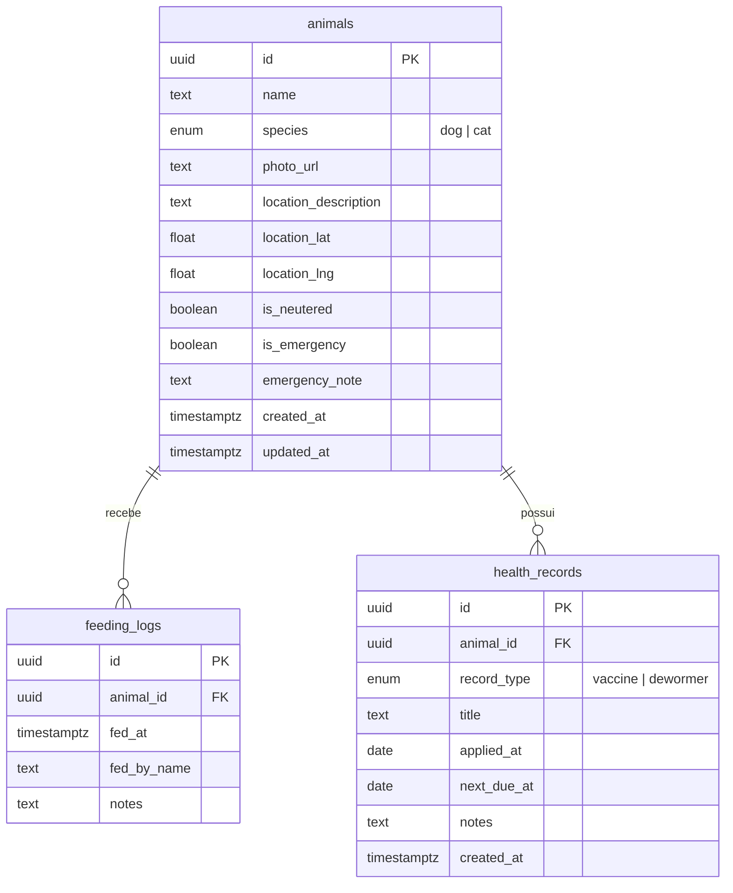

# Passo 1 — Estrutura do Banco de Dados

Backend escolhido: **Supabase** (PostgreSQL gerenciado, SDK oficial para Next.js, deploy na Vercel sem atrito).

## Diagrama de Relacionamento

## Coleções / Tabelas

### `animals` — Cadastro e perfil do animal

| Campo | Tipo | Obrigatório | Descrição |
|-------|------|-------------|-----------|
| `id` | UUID | Sim | Identificador único |
| `name` | TEXT | Sim | Nome ou apelido do animal |
| `species` | ENUM | Sim | `dog` (cão) ou `cat` (gato) |
| `photo_url` | TEXT | Não | URL da foto (Supabase Storage ou externa) |
| `location_description` | TEXT | Sim | Referência humana: "Praça central, perto do mercado" |
| `location_lat` / `location_lng` | FLOAT | Não | Coordenadas GPS opcionais |
| `is_neutered` | BOOLEAN | Sim | Status de castração |
| `is_emergency` | BOOLEAN | Sim | Destaca animal machucado no painel |
| `emergency_note` | TEXT | Não | Detalhes da emergência |
| `created_at` / `updated_at` | TIMESTAMPTZ | Sim | Auditoria |

### `feeding_logs` — Registro de alimentação (Pull/Kanban)

| Campo | Tipo | Obrigatório | Descrição |
|-------|------|-------------|-----------|
| `id` | UUID | Sim | Identificador |
| `animal_id` | UUID (FK) | Sim | Animal alimentado |
| `fed_at` | TIMESTAMPTZ | Sim | Horário do "Alimentei agora" |
| `fed_by_name` | TEXT | Não | Quem registrou |
| `notes` | TEXT | Não | Observações (tipo de ração, etc.) |

**Regra de negócio:** o dashboard exibe `last_fed_at` (último registro) para evitar alimentação em excesso.

### `health_records` — Diário de saúde

| Campo | Tipo | Obrigatório | Descrição |
|-------|------|-------------|-----------|
| `id` | UUID | Sim | Identificador |
| `animal_id` | UUID (FK) | Sim | Animal |
| `record_type` | ENUM | Sim | `vaccine` ou `dewormer` |
| `title` | TEXT | Sim | Ex.: "Antirrábica", "Drontal" |
| `applied_at` | DATE | Sim | Data da aplicação |
| `next_due_at` | DATE | Não | Próximo reforço |
| `notes` | TEXT | Não | Observações |

## View auxiliar

`animals_with_last_feeding` — junta `animals` com a última entrada de `feeding_logs` para o dashboard.

## Como aplicar

1. Crie um projeto em [supabase.com](https://supabase.com)
2. Abra **SQL Editor** → cole o conteúdo de `supabase/migrations/001_initial_schema.sql`
3. Execute e copie **Project URL** e **anon key** para `.env.local`
